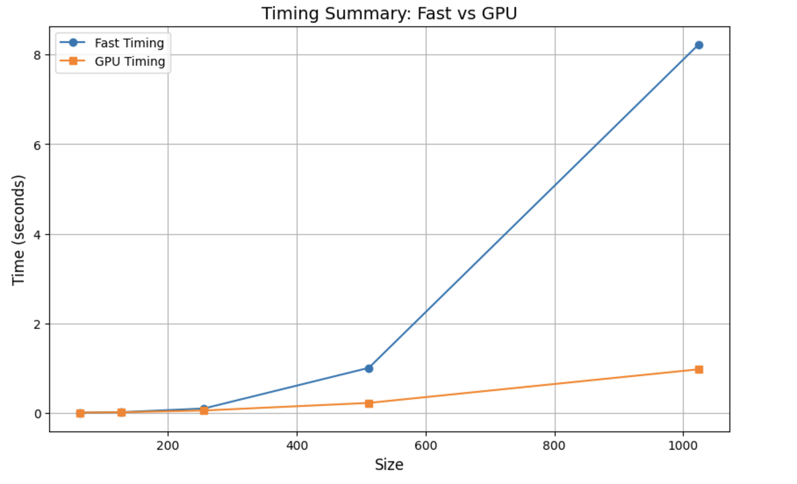

# MiniTorch Module 3


* Docs: https://minitorch.github.io/

* Overview: https://minitorch.github.io/module3.html


You will need to modify `tensor_functions.py` slightly in this assignment.

* Tests:

```
python run_tests.py
```

* Note:

Several of the tests for this assignment will only run if you are on a GPU machine and will not
run on github's test infrastructure. Please follow the instructions to setup up a colab machine
to run these tests.

This assignment requires the following files from the previous assignments. You can get these by running

```bash
python sync_previous_module.py previous-module-dir current-module-dir
```

The files that will be synced are:

        minitorch/tensor_data.py minitorch/tensor_functions.py minitorch/tensor_ops.py minitorch/operators.py minitorch/scalar.py minitorch/scalar_functions.py minitorch/module.py minitorch/autodiff.py minitorch/module.py project/run_manual.py project/run_scalar.py project/run_tensor.py minitorch/operators.py minitorch/module.py minitorch/autodiff.py minitorch/tensor.py minitorch/datasets.py minitorch/testing.py minitorch/optim.py

### 3.1 and 3.2 Parallel Analytics
```
MAP
================================================================================
 Parallel Accelerator Optimizing:  Function tensor_map.<locals>._map,
/Users/marianellasalinas/workspace/mod3-marianellass/minitorch/fast_ops.py (163)

================================================================================


Parallel loop listing for  Function tensor_map.<locals>._map, /Users/marianellasalinas/workspace/mod3-marianellass/minitorch/fast_ops.py (163)
-----------------------------------------------------------------------------|loop #ID
    def _map(                                                                |
        out: Storage,                                                        |
        out_shape: Shape,                                                    |
        out_strides: Strides,                                                |
        in_storage: Storage,                                                 |
        in_shape: Shape,                                                     |
        in_strides: Strides,                                                 |
    ) -> None:                                                               |
        if np.array_equal(in_shape, out_shape) and np.array_equal(           |
            in_strides, out_strides                                          |
        ):                                                                   |
            for i in prange(len(out)):---------------------------------------| #0
                out[i] = fn(in_storage[i])                                   |
        else:                                                                |
            for i in prange(len(out)):---------------------------------------| #1
                out_index = np.empty(MAX_DIMS, np.int32)                     |
                in_index = np.empty(MAX_DIMS, np.int32)                      |
                                                                             |
                to_index(i, out_shape, out_index)                            |
                broadcast_index(out_index, out_shape, in_shape, in_index)    |
                ii = index_to_position(out_index, out_strides)               |
                                                                             |
                j = int(index_to_position(in_index, in_strides))             |
                out[ii] = fn(in_storage[j])                                  |
--------------------------------- Fusing loops ---------------------------------
Attempting fusion of parallel loops (combines loops with similar properties)...
Following the attempted fusion of parallel for-loops there are 2 parallel for-
loop(s) (originating from loops labelled: #0, #1).
--------------------------------------------------------------------------------
----------------------------- Before Optimisation ------------------------------
--------------------------------------------------------------------------------
------------------------------ After Optimisation ------------------------------
Parallel structure is already optimal.
--------------------------------------------------------------------------------
--------------------------------------------------------------------------------

---------------------------Loop invariant code motion---------------------------
Allocation hoisting:
The memory allocation derived from the instruction at
/Users/marianellasalinas/workspace/mod3-marianellass/minitorch/fast_ops.py (178)
 is hoisted out of the parallel loop labelled #1 (it will be performed before
the loop is executed and reused inside the loop):
   Allocation:: out_index = np.empty(MAX_DIMS, np.int32)
    - numpy.empty() is used for the allocation.
The memory allocation derived from the instruction at
/Users/marianellasalinas/workspace/mod3-marianellass/minitorch/fast_ops.py (179)
 is hoisted out of the parallel loop labelled #1 (it will be performed before
the loop is executed and reused inside the loop):
   Allocation:: in_index = np.empty(MAX_DIMS, np.int32)
    - numpy.empty() is used for the allocation.
None
ZIP

================================================================================
 Parallel Accelerator Optimizing:  Function tensor_zip.<locals>._zip,
/Users/marianellasalinas/workspace/mod3-marianellass/minitorch/fast_ops.py (214)

================================================================================


Parallel loop listing for  Function tensor_zip.<locals>._zip, /Users/marianellasalinas/workspace/mod3-marianellass/minitorch/fast_ops.py (214)
----------------------------------------------------------------------------------|loop #ID
    def _zip(                                                                     |
        out: Storage,                                                             |
        out_shape: Shape,                                                         |
        out_strides: Strides,                                                     |
        a_storage: Storage,                                                       |
        a_shape: Shape,                                                           |
        a_strides: Strides,                                                       |
        b_storage: Storage,                                                       |
        b_shape: Shape,                                                           |
        b_strides: Strides,                                                       |
    ) -> None:                                                                    |
        sameShape = np.array_equal(a_shape, b_shape) and np.array_equal(          |
            a_shape, out_shape                                                    |
        )                                                                         |
        sameStrides = np.array_equal(a_strides, b_strides) and np.array_equal(    |
            a_strides, out_strides                                                |
        )                                                                         |
                                                                                  |
        if sameShape and sameStrides:                                             |
            for i in prange(len(out)):--------------------------------------------| #2
                out[i] = fn(a_storage[i], b_storage[i])                           |
        else:                                                                     |
            for i in prange(len(out)):--------------------------------------------| #3
                out_index = np.empty(MAX_DIMS, np.int32)                          |
                a_index = np.empty(MAX_DIMS, np.int32)                            |
                b_index = np.empty(MAX_DIMS, np.int32)                            |
                                                                                  |
                to_index(i, out_shape, out_index)                                 |
                broadcast_index(out_index, out_shape, a_shape, a_index)           |
                broadcast_index(out_index, out_shape, b_shape, b_index)           |
                                                                                  |
                out[i] = fn(                                                      |
                    a_storage[index_to_position(a_index, a_strides)],             |
                    b_storage[index_to_position(b_index, b_strides)],             |
                )                                                                 |
--------------------------------- Fusing loops ---------------------------------
Attempting fusion of parallel loops (combines loops with similar properties)...
Following the attempted fusion of parallel for-loops there are 2 parallel for-
loop(s) (originating from loops labelled: #2, #3).
--------------------------------------------------------------------------------
----------------------------- Before Optimisation ------------------------------
--------------------------------------------------------------------------------
------------------------------ After Optimisation ------------------------------
Parallel structure is already optimal.
--------------------------------------------------------------------------------
--------------------------------------------------------------------------------

---------------------------Loop invariant code motion---------------------------
Allocation hoisting:
The memory allocation derived from the instruction at
/Users/marianellasalinas/workspace/mod3-marianellass/minitorch/fast_ops.py (237)
 is hoisted out of the parallel loop labelled #3 (it will be performed before
the loop is executed and reused inside the loop):
   Allocation:: out_index = np.empty(MAX_DIMS, np.int32)
    - numpy.empty() is used for the allocation.
The memory allocation derived from the instruction at
/Users/marianellasalinas/workspace/mod3-marianellass/minitorch/fast_ops.py (238)
 is hoisted out of the parallel loop labelled #3 (it will be performed before
the loop is executed and reused inside the loop):
   Allocation:: a_index = np.empty(MAX_DIMS, np.int32)
    - numpy.empty() is used for the allocation.
The memory allocation derived from the instruction at
/Users/marianellasalinas/workspace/mod3-marianellass/minitorch/fast_ops.py (239)
 is hoisted out of the parallel loop labelled #3 (it will be performed before
the loop is executed and reused inside the loop):
   Allocation:: b_index = np.empty(MAX_DIMS, np.int32)
    - numpy.empty() is used for the allocation.
None
REDUCE

================================================================================
 Parallel Accelerator Optimizing:  Function tensor_reduce.<locals>._reduce,
/Users/marianellasalinas/workspace/mod3-marianellass/minitorch/fast_ops.py (274)

================================================================================


Parallel loop listing for  Function tensor_reduce.<locals>._reduce, /Users/marianellasalinas/workspace/mod3-marianellass/minitorch/fast_ops.py (274)
----------------------------------------------------------------------|loop #ID
    def _reduce(                                                      |
        out: Storage,                                                 |
        out_shape: Shape,                                             |
        out_strides: Strides,                                         |
        a_storage: Storage,                                           |
        a_shape: Shape,                                               |
        a_strides: Strides,                                           |
        reduce_dim: int,                                              |
    ) -> None:                                                        |
                                                                      |
        reduce_size = a_shape[reduce_dim]                             |
        #reduce_stride = a_strides[reduce_dim]                        |
                                                                      |
        for i in prange(len(out)):------------------------------------| #4
            out_idx = np.empty(MAX_DIMS, np.int32)                    |
                                                                      |
            to_index(i, out_shape, out_idx)                           |
            out_position = index_to_position(out_idx, out_strides)    |
            temp= out[out_position]                                   |
                                                                      |
            for s in range(reduce_size):                              |
                j = 0                                                 |
                out_idx[reduce_dim] = s                               |
                                                                      |
                for x, stride in zip(out_idx, a_strides):             |
                    j += x*stride                                     |
                temp = fn(temp, a_storage[j])                         |
            out[out_position] = temp                                  |
--------------------------------- Fusing loops ---------------------------------
Attempting fusion of parallel loops (combines loops with similar properties)...
Following the attempted fusion of parallel for-loops there are 1 parallel for-
loop(s) (originating from loops labelled: #4).
--------------------------------------------------------------------------------
----------------------------- Before Optimisation ------------------------------
--------------------------------------------------------------------------------
------------------------------ After Optimisation ------------------------------
Parallel structure is already optimal.
--------------------------------------------------------------------------------
--------------------------------------------------------------------------------

---------------------------Loop invariant code motion---------------------------
Allocation hoisting:
The memory allocation derived from the instruction at
/Users/marianellasalinas/workspace/mod3-marianellass/minitorch/fast_ops.py (288)
 is hoisted out of the parallel loop labelled #4 (it will be performed before
the loop is executed and reused inside the loop):
   Allocation:: out_idx = np.empty(MAX_DIMS, np.int32)
    - numpy.empty() is used for the allocation.
None
MATRIX MULTIPLY

================================================================================
 Parallel Accelerator Optimizing:  Function _tensor_matrix_multiply,
/Users/marianellasalinas/workspace/mod3-marianellass/minitorch/fast_ops.py (306)

================================================================================


Parallel loop listing for  Function _tensor_matrix_multiply, /Users/marianellasalinas/workspace/mod3-marianellass/minitorch/fast_ops.py (306)
-------------------------------------------------------------------|loop #ID
def _tensor_matrix_multiply(                                       |
    out: Storage,                                                  |
    out_shape: Shape,                                              |
    out_strides: Strides,                                          |
    a_storage: Storage,                                            |
    a_shape: Shape,                                                |
    a_strides: Strides,                                            |
    b_storage: Storage,                                            |
    b_shape: Shape,                                                |
    b_strides: Strides,                                            |
) -> None:                                                         |
    """NUMBA tensor matrix multiply function.                      |
                                                                   |
    Should work for any tensor shapes that broadcast as long as    |
                                                                   |
    ```                                                            |
    assert a_shape[-1] == b_shape[-2]                              |
    ```                                                            |
                                                                   |
    Optimizations:                                                 |
                                                                   |
    * Outer loop in parallel                                       |
    * No index buffers or function calls                           |
    * Inner loop should have no global writes, 1 multiply.         |
                                                                   |
                                                                   |
    Args:                                                          |
    ----                                                           |
        out (Storage): storage for `out` tensor                    |
        out_shape (Shape): shape for `out` tensor                  |
        out_strides (Strides): strides for `out` tensor            |
        a_storage (Storage): storage for `a` tensor                |
        a_shape (Shape): shape for `a` tensor                      |
        a_strides (Strides): strides for `a` tensor                |
        b_storage (Storage): storage for `b` tensor                |
        b_shape (Shape): shape for `b` tensor                      |
        b_strides (Strides): strides for `b` tensor                |
                                                                   |
    Returns:                                                       |
    -------                                                        |
        None : Fills in `out`                                      |
                                                                   |
    """                                                            |
    a_batch_stride = a_strides[0] if a_shape[0] > 1 else 0         |
    b_batch_stride = b_strides[0] if b_shape[0] > 1 else 0         |
                                                                   |
    for n in prange(out_shape[0]): #loop through batch-------------| #5
        for i in range(out_shape[1]):                              |
            for j in range(out_shape[2]):                          |
                                                                   |
                row = n * a_batch_stride + i * a_strides[1]        |
                col = n * b_batch_stride + j * b_strides[2]        |
                info = 0.0                                         |
                                                                   |
                for _ in range(a_shape[-1]):                       |
                    info += a_storage[row] * b_storage[col]        |
                    row += a_strides[2]                            |
                    col += b_strides[1]                            |
                                                                   |
                out[n * out_strides[0] +                           |
                    i * out_strides[1] +                           |
                    j * out_strides[2]] = info                     |

--------------------------------- Fusing loops ---------------------------------
Attempting fusion of parallel loops (combines loops with similar properties)...
Following the attempted fusion of parallel for-loops there are 1 parallel for-
loop(s) (originating from loops labelled: #5).
--------------------------------------------------------------------------------
----------------------------- Before Optimisation ------------------------------
--------------------------------------------------------------------------------
------------------------------ After Optimisation ------------------------------
Parallel structure is already optimal.
--------------------------------------------------------------------------------
--------------------------------------------------------------------------------

---------------------------Loop invariant code motion---------------------------
Allocation hoisting:
No allocation hoisting found
None
```

### 3.4: Timing Summary 
Timing summary
Size: 64
    fast: 0.00352
    gpu: 0.00639
Size: 128
    fast: 0.01608
    gpu: 0.01463
Size: 256
    fast: 0.09828
    gpu: 0.05335
Size: 512
    fast: 1.00572
    gpu: 0.22285
Size: 1024
    fast: 8.22626
    gpu: 0.97320

Graph: 


### 3.5: Training loss, accuracy and timing

## Smaller Models
#### backend: cpu, dataset: simple, hidden: 100, rate: 0.05, points: 50
Epoch 0 - Loss: 4.6969 - Correct: 36 (Time: 17.1872 sec)
Epoch 10 - Loss: 1.0587 - Correct: 49 (Time: 0.1202 sec)
Epoch 20 - Loss: 1.1853 - Correct: 49 (Time: 0.1225 sec)
Epoch 30 - Loss: 1.3594 - Correct: 50 (Time: 0.1193 sec)
Epoch 40 - Loss: 0.8814 - Correct: 50 (Time: 0.1225 sec)
Epoch 50 - Loss: 1.6139 - Correct: 49 (Time: 0.2428 sec)
Epoch 60 - Loss: 2.1298 - Correct: 49 (Time: 0.1234 sec)
Epoch 70 - Loss: 0.8900 - Correct: 49 (Time: 0.1196 sec)
Epoch 80 - Loss: 0.5005 - Correct: 49 (Time: 0.1204 sec)
Epoch 90 - Loss: 1.8788 - Correct: 48 (Time: 0.1222 sec)
Epoch 100 - Loss: 0.1916 - Correct: 50 (Time: 0.1252 sec)
Epoch 110 - Loss: 0.6082 - Correct: 49 (Time: 0.1276 sec)
Epoch 120 - Loss: 0.9987 - Correct: 50 (Time: 0.1209 sec)
Epoch 130 - Loss: 1.1781 - Correct: 50 (Time: 0.1344 sec)
Epoch 140 - Loss: 1.3338 - Correct: 49 (Time: 0.2761 sec)
Epoch 150 - Loss: 0.0447 - Correct: 50 (Time: 0.1194 sec)
Epoch 160 - Loss: 0.4163 - Correct: 50 (Time: 0.1371 sec)
Epoch 170 - Loss: 0.2335 - Correct: 50 (Time: 0.1234 sec)
Epoch 180 - Loss: 0.6465 - Correct: 50 (Time: 0.1212 sec)
Epoch 190 - Loss: 0.6998 - Correct: 49 (Time: 0.1241 sec)
Epoch 200 - Loss: 0.0394 - Correct: 49 (Time: 0.1243 sec)
Epoch 210 - Loss: 0.5871 - Correct: 49 (Time: 0.1301 sec)
Epoch 220 - Loss: 0.1499 - Correct: 50 (Time: 0.1235 sec)
Epoch 230 - Loss: 0.1796 - Correct: 50 (Time: 0.1898 sec)
Epoch 240 - Loss: 0.0959 - Correct: 50 (Time: 0.1752 sec)
Epoch 250 - Loss: 0.0776 - Correct: 50 (Time: 0.1211 sec)
Epoch 260 - Loss: 0.0142 - Correct: 49 (Time: 0.1220 sec)
Epoch 270 - Loss: 0.6156 - Correct: 49 (Time: 0.1236 sec)
Epoch 280 - Loss: 0.0028 - Correct: 50 (Time: 0.1265 sec)
Epoch 290 - Loss: 0.3241 - Correct: 50 (Time: 0.1211 sec)
Epoch 300 - Loss: 0.6394 - Correct: 50 (Time: 0.1301 sec)
Epoch 310 - Loss: 0.1787 - Correct: 50 (Time: 0.1234 sec)
Epoch 320 - Loss: 0.2322 - Correct: 49 (Time: 0.1216 sec)
Epoch 330 - Loss: 0.1331 - Correct: 49 (Time: 0.2269 sec)
Epoch 340 - Loss: 0.5209 - Correct: 50 (Time: 0.1363 sec)
Epoch 350 - Loss: 0.7498 - Correct: 49 (Time: 0.1226 sec)
Epoch 360 - Loss: 0.3670 - Correct: 49 (Time: 0.1222 sec)
Epoch 370 - Loss: 0.8859 - Correct: 50 (Time: 0.1231 sec)
Epoch 380 - Loss: 0.9679 - Correct: 50 (Time: 0.1203 sec)
Epoch 390 - Loss: 0.0681 - Correct: 50 (Time: 0.1205 sec)
Epoch 400 - Loss: 0.0635 - Correct: 50 (Time: 0.1190 sec)
Epoch 410 - Loss: 0.2795 - Correct: 50 (Time: 0.1357 sec)
Epoch 420 - Loss: 0.0526 - Correct: 50 (Time: 0.2193 sec)
Epoch 430 - Loss: 0.1035 - Correct: 50 (Time: 0.1268 sec)
Epoch 440 - Loss: 0.4296 - Correct: 49 (Time: 0.1280 sec)
Epoch 450 - Loss: 0.6088 - Correct: 50 (Time: 0.1205 sec)
Epoch 460 - Loss: 0.0016 - Correct: 50 (Time: 0.1222 sec)
Epoch 470 - Loss: 0.0639 - Correct: 49 (Time: 0.1246 sec)
Epoch 480 - Loss: 0.3774 - Correct: 50 (Time: 0.1325 sec)
Epoch 490 - Loss: 0.0041 - Correct: 49 (Time: 0.1410 sec)

#### backend: gpu, dataset: simple, hidden: 100, rate: 0.05, points: 50
Epoch 0 - Loss: 5.1630 - Correct: 33 (Time: 5.0502 sec)
Epoch 10 - Loss: 1.5289 - Correct: 47 (Time: 1.6491 sec)
Epoch 20 - Loss: 1.6041 - Correct: 48 (Time: 1.6135 sec)
Epoch 30 - Loss: 0.4352 - Correct: 49 (Time: 1.6387 sec)
Epoch 40 - Loss: 0.9476 - Correct: 49 (Time: 1.6508 sec)
Epoch 50 - Loss: 0.4971 - Correct: 48 (Time: 1.8622 sec)
Epoch 60 - Loss: 0.4816 - Correct: 50 (Time: 1.6786 sec)
Epoch 70 - Loss: 1.7575 - Correct: 49 (Time: 2.2845 sec)
Epoch 80 - Loss: 0.2867 - Correct: 48 (Time: 1.6993 sec)
Epoch 90 - Loss: 0.7067 - Correct: 50 (Time: 1.7113 sec)
Epoch 100 - Loss: 0.4553 - Correct: 50 (Time: 1.6637 sec)
Epoch 110 - Loss: 0.1658 - Correct: 50 (Time: 1.6542 sec)
Epoch 120 - Loss: 1.5162 - Correct: 49 (Time: 1.8100 sec)
Epoch 130 - Loss: 0.9418 - Correct: 50 (Time: 1.6329 sec)
Epoch 140 - Loss: 0.1023 - Correct: 48 (Time: 2.4280 sec)
Epoch 150 - Loss: 0.9058 - Correct: 50 (Time: 1.6925 sec)
Epoch 160 - Loss: 0.0601 - Correct: 50 (Time: 1.7672 sec)
Epoch 170 - Loss: 0.5131 - Correct: 49 (Time: 1.7348 sec)
Epoch 180 - Loss: 0.3652 - Correct: 50 (Time: 1.7241 sec)
Epoch 190 - Loss: 0.2033 - Correct: 50 (Time: 1.8418 sec)
Epoch 200 - Loss: 0.5112 - Correct: 49 (Time: 1.6776 sec)
Epoch 210 - Loss: 0.3305 - Correct: 49 (Time: 1.7036 sec)
Epoch 220 - Loss: 0.1937 - Correct: 50 (Time: 1.6434 sec)
Epoch 230 - Loss: 0.6127 - Correct: 50 (Time: 2.3069 sec)
Epoch 240 - Loss: 0.5985 - Correct: 49 (Time: 1.7015 sec)
Epoch 250 - Loss: 1.3126 - Correct: 49 (Time: 2.0478 sec)
Epoch 260 - Loss: 0.7411 - Correct: 50 (Time: 1.6725 sec)
Epoch 270 - Loss: 0.9129 - Correct: 49 (Time: 1.6436 sec)
Epoch 280 - Loss: 0.0792 - Correct: 50 (Time: 1.6948 sec)
Epoch 290 - Loss: 0.7405 - Correct: 50 (Time: 1.6547 sec)
Epoch 300 - Loss: 0.0898 - Correct: 49 (Time: 1.8257 sec)
Epoch 310 - Loss: 0.4340 - Correct: 50 (Time: 1.6988 sec)
Epoch 320 - Loss: 0.6662 - Correct: 50 (Time: 2.2464 sec)
Epoch 330 - Loss: 0.1590 - Correct: 49 (Time: 1.6796 sec)
Epoch 340 - Loss: 0.0435 - Correct: 49 (Time: 1.6288 sec)
Epoch 350 - Loss: 1.8241 - Correct: 48 (Time: 1.6743 sec)
Epoch 360 - Loss: 0.1676 - Correct: 50 (Time: 1.6854 sec)
Epoch 370 - Loss: 0.4107 - Correct: 50 (Time: 1.9674 sec)
Epoch 380 - Loss: 0.0030 - Correct: 49 (Time: 1.6640 sec)
Epoch 390 - Loss: 0.3096 - Correct: 49 (Time: 2.3509 sec)
Epoch 400 - Loss: 0.5608 - Correct: 50 (Time: 1.6583 sec)
Epoch 410 - Loss: 0.0054 - Correct: 49 (Time: 2.0823 sec)
Epoch 420 - Loss: 0.0572 - Correct: 50 (Time: 1.6649 sec)
Epoch 430 - Loss: 0.9306 - Correct: 49 (Time: 1.7814 sec)
Epoch 440 - Loss: 0.1001 - Correct: 50 (Time: 1.7261 sec)
Epoch 450 - Loss: 0.2957 - Correct: 50 (Time: 1.7019 sec)
Epoch 460 - Loss: 0.9214 - Correct: 49 (Time: 1.7591 sec)
Epoch 470 - Loss: 0.0469 - Correct: 49 (Time: 1.7853 sec)
Epoch 480 - Loss: 0.0176 - Correct: 47 (Time: 1.7846 sec)
Epoch 490 - Loss: 3.0078 - Correct: 44 (Time: 1.8108 sec)

#### backend: cpu, dataset: split, hidden: 100, rate: 0.05, points: 50
Epoch 0 - Loss: 9.8192 - Correct: 31 (Time: 16.3139 sec)
Epoch 10 - Loss: 6.3146 - Correct: 31 (Time: 0.2518 sec)
Epoch 20 - Loss: 5.7573 - Correct: 42 (Time: 0.2677 sec)
Epoch 30 - Loss: 7.3302 - Correct: 34 (Time: 0.1259 sec)
Epoch 40 - Loss: 4.9638 - Correct: 41 (Time: 0.2887 sec)
Epoch 50 - Loss: 4.5756 - Correct: 44 (Time: 0.1249 sec)
Epoch 60 - Loss: 4.8746 - Correct: 47 (Time: 0.1255 sec)
Epoch 70 - Loss: 3.1529 - Correct: 40 (Time: 0.1240 sec)
Epoch 80 - Loss: 2.8535 - Correct: 47 (Time: 0.1247 sec)
Epoch 90 - Loss: 2.0590 - Correct: 48 (Time: 0.1269 sec)
Epoch 100 - Loss: 3.5283 - Correct: 48 (Time: 0.1281 sec)
Epoch 110 - Loss: 2.5116 - Correct: 48 (Time: 0.1233 sec)
Epoch 120 - Loss: 2.1847 - Correct: 46 (Time: 0.1256 sec)
Epoch 130 - Loss: 3.6026 - Correct: 48 (Time: 0.2775 sec)
Epoch 140 - Loss: 1.6356 - Correct: 49 (Time: 0.1191 sec)
Epoch 150 - Loss: 1.7534 - Correct: 43 (Time: 0.1247 sec)
Epoch 160 - Loss: 1.0689 - Correct: 46 (Time: 0.1210 sec)
Epoch 170 - Loss: 3.6808 - Correct: 47 (Time: 0.1321 sec)
Epoch 180 - Loss: 1.4683 - Correct: 49 (Time: 0.1218 sec)
Epoch 190 - Loss: 1.6359 - Correct: 48 (Time: 0.1251 sec)
Epoch 200 - Loss: 1.6439 - Correct: 49 (Time: 0.1287 sec)
Epoch 210 - Loss: 1.6764 - Correct: 47 (Time: 0.1225 sec)
Epoch 220 - Loss: 1.5604 - Correct: 49 (Time: 0.2713 sec)
Epoch 230 - Loss: 0.7804 - Correct: 47 (Time: 0.1827 sec)
Epoch 240 - Loss: 1.9923 - Correct: 48 (Time: 0.1224 sec)
Epoch 250 - Loss: 1.3964 - Correct: 49 (Time: 0.1235 sec)
Epoch 260 - Loss: 0.9883 - Correct: 49 (Time: 0.1265 sec)
Epoch 270 - Loss: 2.3038 - Correct: 49 (Time: 0.1196 sec)
Epoch 280 - Loss: 1.3061 - Correct: 49 (Time: 0.1238 sec)
Epoch 290 - Loss: 0.4803 - Correct: 47 (Time: 0.1309 sec)
Epoch 300 - Loss: 1.7597 - Correct: 49 (Time: 0.1232 sec)
Epoch 310 - Loss: 0.9411 - Correct: 49 (Time: 0.2184 sec)
Epoch 320 - Loss: 0.1634 - Correct: 48 (Time: 0.2224 sec)
Epoch 330 - Loss: 3.0086 - Correct: 48 (Time: 0.1266 sec)
Epoch 340 - Loss: 1.1621 - Correct: 49 (Time: 0.1238 sec)
Epoch 350 - Loss: 0.3162 - Correct: 50 (Time: 0.1235 sec)
Epoch 360 - Loss: 0.2459 - Correct: 48 (Time: 0.1229 sec)
Epoch 370 - Loss: 2.5165 - Correct: 47 (Time: 0.1322 sec)
Epoch 380 - Loss: 1.6022 - Correct: 48 (Time: 0.1391 sec)
Epoch 390 - Loss: 1.3561 - Correct: 50 (Time: 0.1253 sec)
Epoch 400 - Loss: 1.8594 - Correct: 46 (Time: 0.1213 sec)
Epoch 410 - Loss: 0.2880 - Correct: 49 (Time: 0.2231 sec)
Epoch 420 - Loss: 0.7795 - Correct: 49 (Time: 0.1211 sec)
Epoch 430 - Loss: 2.2305 - Correct: 48 (Time: 0.1217 sec)
Epoch 440 - Loss: 1.5564 - Correct: 49 (Time: 0.1212 sec)
Epoch 450 - Loss: 0.7650 - Correct: 50 (Time: 0.1206 sec)
Epoch 460 - Loss: 0.6865 - Correct: 49 (Time: 0.1239 sec)
Epoch 470 - Loss: 0.2181 - Correct: 49 (Time: 0.1217 sec)
Epoch 480 - Loss: 0.3606 - Correct: 48 (Time: 0.1259 sec)
Epoch 490 - Loss: 0.9526 - Correct: 49 (Time: 0.1364 sec)

#### backend: gpu, dataset: split, hidden: 100, rate: 0.05, points: 50
Epoch 0 - Loss: 10.1155 - Correct: 27 (Time: 4.3180 sec)
Epoch 10 - Loss: 5.0328 - Correct: 34 (Time: 1.5613 sec)
Epoch 20 - Loss: 3.8913 - Correct: 44 (Time: 1.5131 sec)
Epoch 30 - Loss: 3.2678 - Correct: 46 (Time: 1.8069 sec)
Epoch 40 - Loss: 2.8235 - Correct: 49 (Time: 1.5321 sec)
Epoch 50 - Loss: 3.1438 - Correct: 49 (Time: 1.6575 sec)
Epoch 60 - Loss: 2.1609 - Correct: 49 (Time: 2.1573 sec)
Epoch 70 - Loss: 1.7774 - Correct: 49 (Time: 1.5351 sec)
Epoch 80 - Loss: 2.0819 - Correct: 49 (Time: 1.4984 sec)
Epoch 90 - Loss: 1.1129 - Correct: 49 (Time: 1.7493 sec)
Epoch 100 - Loss: 1.6338 - Correct: 49 (Time: 1.5028 sec)
Epoch 110 - Loss: 1.3648 - Correct: 49 (Time: 1.4934 sec)
Epoch 120 - Loss: 1.5403 - Correct: 49 (Time: 1.5318 sec)
Epoch 130 - Loss: 1.1812 - Correct: 49 (Time: 1.4895 sec)
Epoch 140 - Loss: 1.0280 - Correct: 49 (Time: 1.4953 sec)
Epoch 150 - Loss: 1.5833 - Correct: 48 (Time: 1.5303 sec)
Epoch 160 - Loss: 0.8484 - Correct: 49 (Time: 1.6153 sec)
Epoch 170 - Loss: 1.0645 - Correct: 50 (Time: 1.5145 sec)
Epoch 180 - Loss: 0.7695 - Correct: 49 (Time: 1.5042 sec)
Epoch 190 - Loss: 1.1598 - Correct: 49 (Time: 2.0281 sec)
Epoch 200 - Loss: 0.2254 - Correct: 50 (Time: 1.4901 sec)
Epoch 210 - Loss: 0.5376 - Correct: 49 (Time: 1.5118 sec)
Epoch 220 - Loss: 0.5668 - Correct: 50 (Time: 2.2466 sec)
Epoch 230 - Loss: 1.6813 - Correct: 48 (Time: 1.4903 sec)
Epoch 240 - Loss: 0.9442 - Correct: 49 (Time: 1.4960 sec)
Epoch 250 - Loss: 0.3449 - Correct: 49 (Time: 2.1775 sec)
Epoch 260 - Loss: 3.6333 - Correct: 46 (Time: 1.4729 sec)
Epoch 270 - Loss: 0.5076 - Correct: 49 (Time: 1.4961 sec)
Epoch 280 - Loss: 0.1608 - Correct: 49 (Time: 1.8078 sec)
Epoch 290 - Loss: 0.2072 - Correct: 48 (Time: 1.5077 sec)
Epoch 300 - Loss: 1.8193 - Correct: 48 (Time: 1.4908 sec)
Epoch 310 - Loss: 0.1164 - Correct: 49 (Time: 1.5493 sec)
Epoch 320 - Loss: 0.0107 - Correct: 50 (Time: 1.5260 sec)
Epoch 330 - Loss: 1.4362 - Correct: 49 (Time: 1.4907 sec)
Epoch 340 - Loss: 0.0467 - Correct: 49 (Time: 1.5103 sec)
Epoch 350 - Loss: 0.0360 - Correct: 50 (Time: 1.7693 sec)
Epoch 360 - Loss: 0.0617 - Correct: 48 (Time: 1.4939 sec)
Epoch 370 - Loss: 3.8804 - Correct: 50 (Time: 1.5444 sec)
Epoch 380 - Loss: 0.0088 - Correct: 49 (Time: 2.1428 sec)
Epoch 390 - Loss: 0.0068 - Correct: 50 (Time: 1.4962 sec)
Epoch 400 - Loss: 0.8441 - Correct: 51 (Time: 1.4759 sec)
Epoch 410 - Loss: 0.0114 - Correct: 49 (Time: 2.1953 sec)
Epoch 420 - Loss: 5.1270 - Correct: 50 (Time: 1.5218 sec)
Epoch 430 - Loss: 23.7759 - Correct: 35 (Time: 1.5753 sec)
Epoch 440 - Loss: 0.0098 - Correct: 50 (Time: 1.8752 sec)
Epoch 450 - Loss: 0.0443 - Correct: 50 (Time: 1.5045 sec)
Epoch 460 - Loss: 1.5786 - Correct: 49 (Time: 1.5516 sec)
Epoch 470 - Loss: 0.0228 - Correct: 50 (Time: 1.5197 sec)
Epoch 480 - Loss: 5.0566 - Correct: 51 (Time: 1.5302 sec)
Epoch 490 - Loss: 1.9785 - Correct: 49 (Time: 1.5400 sec)

#### backend: cpu, dataset: xor, hidden: 100, rate: 0.05, points: 50
Epoch 0 - Loss: 6.1212 - Correct: 32 (Time: 17.1577 sec)
Epoch 10 - Loss: 4.5798 - Correct: 42 (Time: 0.1209 sec)
Epoch 20 - Loss: 3.8462 - Correct: 41 (Time: 0.1198 sec)
Epoch 30 - Loss: 3.8358 - Correct: 41 (Time: 0.1209 sec)
Epoch 40 - Loss: 4.4063 - Correct: 40 (Time: 0.1369 sec)
Epoch 50 - Loss: 1.2962 - Correct: 46 (Time: 0.2787 sec)
Epoch 60 - Loss: 2.1519 - Correct: 47 (Time: 0.1212 sec)
Epoch 70 - Loss: 2.7912 - Correct: 48 (Time: 0.1160 sec)
Epoch 80 - Loss: 1.9021 - Correct: 49 (Time: 0.1309 sec)
Epoch 90 - Loss: 2.2205 - Correct: 49 (Time: 0.1203 sec)
Epoch 100 - Loss: 2.7470 - Correct: 49 (Time: 0.1196 sec)
Epoch 110 - Loss: 1.3885 - Correct: 49 (Time: 0.1163 sec)
Epoch 120 - Loss: 1.0446 - Correct: 49 (Time: 0.1201 sec)
Epoch 130 - Loss: 1.1152 - Correct: 49 (Time: 0.1174 sec)
Epoch 140 - Loss: 0.5699 - Correct: 49 (Time: 0.2144 sec)
Epoch 150 - Loss: 1.8636 - Correct: 49 (Time: 0.2658 sec)
Epoch 160 - Loss: 2.2860 - Correct: 50 (Time: 0.1234 sec)
Epoch 170 - Loss: 0.6389 - Correct: 49 (Time: 0.1205 sec)
Epoch 180 - Loss: 1.5924 - Correct: 49 (Time: 0.1198 sec)
Epoch 190 - Loss: 0.8098 - Correct: 49 (Time: 0.1182 sec)
Epoch 200 - Loss: 0.4115 - Correct: 49 (Time: 0.1188 sec)
Epoch 210 - Loss: 0.3500 - Correct: 49 (Time: 0.1198 sec)
Epoch 220 - Loss: 0.5928 - Correct: 49 (Time: 0.1324 sec)
Epoch 230 - Loss: 0.4249 - Correct: 50 (Time: 0.1204 sec)
Epoch 240 - Loss: 2.1548 - Correct: 49 (Time: 0.1566 sec)
Epoch 250 - Loss: 0.3188 - Correct: 50 (Time: 0.1240 sec)
Epoch 260 - Loss: 2.0881 - Correct: 49 (Time: 0.1247 sec)
Epoch 270 - Loss: 1.6891 - Correct: 49 (Time: 0.1239 sec)
Epoch 280 - Loss: 0.8741 - Correct: 49 (Time: 0.1189 sec)
Epoch 290 - Loss: 0.2196 - Correct: 49 (Time: 0.1202 sec)
Epoch 300 - Loss: 1.2704 - Correct: 49 (Time: 0.1344 sec)
Epoch 310 - Loss: 0.2568 - Correct: 49 (Time: 0.1239 sec)
Epoch 320 - Loss: 0.3413 - Correct: 49 (Time: 0.1225 sec)
Epoch 330 - Loss: 1.1978 - Correct: 49 (Time: 0.2829 sec)
Epoch 340 - Loss: 0.3398 - Correct: 49 (Time: 0.2553 sec)
Epoch 350 - Loss: 0.8941 - Correct: 49 (Time: 0.1195 sec)
Epoch 360 - Loss: 0.6659 - Correct: 49 (Time: 0.1186 sec)
Epoch 370 - Loss: 0.2983 - Correct: 49 (Time: 0.1194 sec)
Epoch 380 - Loss: 0.3836 - Correct: 49 (Time: 0.1237 sec)
Epoch 390 - Loss: 0.1371 - Correct: 49 (Time: 0.1212 sec)
Epoch 400 - Loss: 0.1229 - Correct: 49 (Time: 0.1228 sec)
Epoch 410 - Loss: 0.8923 - Correct: 49 (Time: 0.1204 sec)
Epoch 420 - Loss: 1.1841 - Correct: 49 (Time: 0.1291 sec)
Epoch 430 - Loss: 0.4006 - Correct: 50 (Time: 0.2421 sec)
Epoch 440 - Loss: 0.0699 - Correct: 49 (Time: 0.1208 sec)
Epoch 450 - Loss: 0.1714 - Correct: 49 (Time: 0.1186 sec)
Epoch 460 - Loss: 0.0903 - Correct: 49 (Time: 0.1255 sec)
Epoch 470 - Loss: 0.1671 - Correct: 49 (Time: 0.2034 sec)
Epoch 480 - Loss: 0.2231 - Correct: 50 (Time: 0.2241 sec)
Epoch 490 - Loss: 1.9349 - Correct: 49 (Time: 0.1279 sec)

#### backend: gpu, dataset: xor, hidden: 100, rate: 0.05, points: 50
Epoch 0 - Loss: 7.1691 - Correct: 36 (Time: 3.8484 sec)
Epoch 10 - Loss: 4.4156 - Correct: 40 (Time: 1.4688 sec)
Epoch 20 - Loss: 5.0905 - Correct: 45 (Time: 1.7072 sec)
Epoch 30 - Loss: 2.8962 - Correct: 46 (Time: 1.4989 sec)
Epoch 40 - Loss: 4.9008 - Correct: 48 (Time: 1.5466 sec)
Epoch 50 - Loss: 1.9716 - Correct: 48 (Time: 1.5349 sec)
Epoch 60 - Loss: 4.1635 - Correct: 44 (Time: 1.6075 sec)
Epoch 70 - Loss: 1.1531 - Correct: 47 (Time: 1.5108 sec)
Epoch 80 - Loss: 1.1185 - Correct: 48 (Time: 1.5235 sec)
Epoch 90 - Loss: 1.5990 - Correct: 47 (Time: 1.9609 sec)
Epoch 100 - Loss: 1.2769 - Correct: 48 (Time: 1.4939 sec)
Epoch 110 - Loss: 2.9671 - Correct: 44 (Time: 1.4825 sec)
Epoch 120 - Loss: 2.1780 - Correct: 47 (Time: 2.3081 sec)
Epoch 130 - Loss: 1.1222 - Correct: 47 (Time: 1.4888 sec)
Epoch 140 - Loss: 0.4977 - Correct: 48 (Time: 1.5001 sec)
Epoch 150 - Loss: 0.4117 - Correct: 48 (Time: 1.8101 sec)
Epoch 160 - Loss: 0.4303 - Correct: 47 (Time: 1.4728 sec)
Epoch 170 - Loss: 0.5138 - Correct: 47 (Time: 1.4911 sec)
Epoch 180 - Loss: 1.9196 - Correct: 48 (Time: 1.4891 sec)
Epoch 190 - Loss: 1.5459 - Correct: 47 (Time: 1.5960 sec)
Epoch 200 - Loss: 1.7399 - Correct: 48 (Time: 1.4820 sec)
Epoch 210 - Loss: 0.3983 - Correct: 48 (Time: 1.4807 sec)
Epoch 220 - Loss: 0.5014 - Correct: 47 (Time: 1.7850 sec)
Epoch 230 - Loss: 2.1887 - Correct: 49 (Time: 1.4939 sec)
Epoch 240 - Loss: 0.6370 - Correct: 47 (Time: 1.4782 sec)
Epoch 250 - Loss: 0.1505 - Correct: 47 (Time: 2.2160 sec)
Epoch 260 - Loss: 0.9360 - Correct: 49 (Time: 1.4907 sec)
Epoch 270 - Loss: 0.3371 - Correct: 47 (Time: 1.5075 sec)
Epoch 280 - Loss: 0.2039 - Correct: 49 (Time: 2.1779 sec)
Epoch 290 - Loss: 1.1787 - Correct: 48 (Time: 1.5031 sec)
Epoch 300 - Loss: 0.1001 - Correct: 49 (Time: 1.5227 sec)
Epoch 310 - Loss: 0.2099 - Correct: 47 (Time: 1.8233 sec)
Epoch 320 - Loss: 2.0688 - Correct: 46 (Time: 1.4854 sec)
Epoch 330 - Loss: 1.0324 - Correct: 48 (Time: 1.4955 sec)
Epoch 340 - Loss: 0.5588 - Correct: 47 (Time: 1.4761 sec)
Epoch 350 - Loss: 0.3219 - Correct: 49 (Time: 1.4941 sec)
Epoch 360 - Loss: 0.6831 - Correct: 49 (Time: 1.4988 sec)
Epoch 370 - Loss: 0.2463 - Correct: 49 (Time: 1.5896 sec)
Epoch 380 - Loss: 1.1712 - Correct: 47 (Time: 1.8673 sec)
Epoch 390 - Loss: 0.4266 - Correct: 49 (Time: 1.5800 sec)
Epoch 400 - Loss: 4.5635 - Correct: 46 (Time: 1.5310 sec)
Epoch 410 - Loss: 0.5039 - Correct: 49 (Time: 1.8076 sec)
Epoch 420 - Loss: 0.7967 - Correct: 48 (Time: 1.6694 sec)
Epoch 430 - Loss: 0.4418 - Correct: 49 (Time: 2.3089 sec)
Epoch 440 - Loss: 6.0379 - Correct: 38 (Time: 1.6733 sec)
Epoch 450 - Loss: 0.5068 - Correct: 49 (Time: 1.6584 sec)
Epoch 460 - Loss: 0.1385 - Correct: 49 (Time: 1.6573 sec)
Epoch 470 - Loss: 0.4376 - Correct: 47 (Time: 1.6009 sec)
Epoch 480 - Loss: 5.6805 - Correct: 41 (Time: 2.2828 sec)
Epoch 490 - Loss: 0.5430 - Correct: 48 (Time: 1.7221 sec)

### Larger models
#### backend: gpu, dataset: simple, hidden: 250, rate: 0.05, points: 50
Epoch 0 - Loss: 1.4634 - Correct: 40 (Time: 4.7549 sec)
Epoch 10 - Loss: 1.0648 - Correct: 46 (Time: 1.8365 sec)
Epoch 20 - Loss: 0.3554 - Correct: 45 (Time: 1.8532 sec)
Epoch 30 - Loss: 3.7631 - Correct: 42 (Time: 1.8969 sec)
Epoch 40 - Loss: 1.2931 - Correct: 47 (Time: 2.7013 sec)
Epoch 50 - Loss: 0.9622 - Correct: 46 (Time: 1.9672 sec)
Epoch 60 - Loss: 0.0003 - Correct: 46 (Time: 1.9299 sec)
Epoch 70 - Loss: 0.5775 - Correct: 48 (Time: 1.8833 sec)
Epoch 80 - Loss: 2.2590 - Correct: 46 (Time: 1.8986 sec)
Epoch 90 - Loss: 0.1442 - Correct: 46 (Time: 2.4907 sec)
Epoch 100 - Loss: 1.2458 - Correct: 49 (Time: 1.8771 sec)
Epoch 110 - Loss: 0.2222 - Correct: 47 (Time: 1.8927 sec)
Epoch 120 - Loss: 0.6422 - Correct: 47 (Time: 2.2220 sec)
Epoch 130 - Loss: 0.0207 - Correct: 48 (Time: 1.8821 sec)
Epoch 140 - Loss: 1.5081 - Correct: 46 (Time: 2.1070 sec)
Epoch 150 - Loss: 1.0997 - Correct: 46 (Time: 1.9309 sec)
Epoch 160 - Loss: 0.6141 - Correct: 46 (Time: 1.9095 sec)
Epoch 170 - Loss: 0.1429 - Correct: 46 (Time: 2.9057 sec)
Epoch 180 - Loss: 3.0771 - Correct: 43 (Time: 1.8809 sec)
Epoch 190 - Loss: 1.5676 - Correct: 46 (Time: 1.9910 sec)
Epoch 200 - Loss: 0.1970 - Correct: 49 (Time: 2.1027 sec)
Epoch 210 - Loss: 0.6586 - Correct: 48 (Time: 1.9020 sec)
Epoch 220 - Loss: 0.0197 - Correct: 46 (Time: 2.2060 sec)
Epoch 230 - Loss: 2.7806 - Correct: 46 (Time: 1.9017 sec)
Epoch 240 - Loss: 0.0295 - Correct: 48 (Time: 1.8575 sec)
Epoch 250 - Loss: 0.3884 - Correct: 49 (Time: 2.4410 sec)
Epoch 260 - Loss: 0.0105 - Correct: 47 (Time: 1.8762 sec)
Epoch 270 - Loss: 1.5209 - Correct: 47 (Time: 2.0228 sec)
Epoch 280 - Loss: 1.5063 - Correct: 47 (Time: 1.8871 sec)
Epoch 290 - Loss: 0.8833 - Correct: 49 (Time: 1.8715 sec)
Epoch 300 - Loss: 0.0033 - Correct: 48 (Time: 2.7538 sec)
Epoch 310 - Loss: 0.0464 - Correct: 49 (Time: 1.9387 sec)
Epoch 320 - Loss: 0.7675 - Correct: 48 (Time: 1.8421 sec)
Epoch 330 - Loss: 0.5434 - Correct: 49 (Time: 1.8430 sec)
Epoch 340 - Loss: 0.0675 - Correct: 49 (Time: 1.8756 sec)
Epoch 350 - Loss: 1.7594 - Correct: 46 (Time: 2.7575 sec)
Epoch 360 - Loss: 0.9575 - Correct: 48 (Time: 1.8618 sec)
Epoch 370 - Loss: 0.0850 - Correct: 49 (Time: 1.9224 sec)
Epoch 380 - Loss: 0.1222 - Correct: 46 (Time: 1.9002 sec)
Epoch 390 - Loss: 1.0157 - Correct: 47 (Time: 1.9287 sec)
Epoch 400 - Loss: 0.9471 - Correct: 47 (Time: 2.6743 sec)
Epoch 410 - Loss: 0.0433 - Correct: 47 (Time: 1.8717 sec)
Epoch 420 - Loss: 0.1053 - Correct: 48 (Time: 1.8977 sec)
Epoch 430 - Loss: 1.5706 - Correct: 46 (Time: 2.1132 sec)
Epoch 440 - Loss: 0.8358 - Correct: 49 (Time: 1.8738 sec)
Epoch 450 - Loss: 0.4339 - Correct: 49 (Time: 2.4615 sec)
Epoch 460 - Loss: 0.1064 - Correct: 48 (Time: 1.8212 sec)
Epoch 470 - Loss: 0.0868 - Correct: 48 (Time: 1.7963 sec)
Epoch 480 - Loss: 0.0000 - Correct: 47 (Time: 1.8021 sec)
Epoch 490 - Loss: 0.6163 - Correct: 48 (Time: 1.9061 sec)

#### backend: gpu, dataset: xor, hidden: 250, rate: 0.05, points: 50
Epoch 0 - Loss: 9.3729 - Correct: 31 (Time: 4.1982 sec)
Epoch 10 - Loss: 2.9564 - Correct: 43 (Time: 1.8112 sec)
Epoch 20 - Loss: 2.1465 - Correct: 44 (Time: 1.6235 sec)
Epoch 30 - Loss: 2.1965 - Correct: 45 (Time: 1.6316 sec)
Epoch 40 - Loss: 3.9643 - Correct: 45 (Time: 1.6194 sec)
Epoch 50 - Loss: 0.8427 - Correct: 47 (Time: 1.6804 sec)
Epoch 60 - Loss: 2.4041 - Correct: 48 (Time: 2.4184 sec)
Epoch 70 - Loss: 1.1956 - Correct: 46 (Time: 1.6373 sec)
Epoch 80 - Loss: 0.7556 - Correct: 49 (Time: 1.6550 sec)
Epoch 90 - Loss: 0.4910 - Correct: 48 (Time: 1.6658 sec)
Epoch 100 - Loss: 1.8925 - Correct: 49 (Time: 1.6244 sec)
Epoch 110 - Loss: 1.6260 - Correct: 49 (Time: 1.6713 sec)
Epoch 120 - Loss: 0.2873 - Correct: 49 (Time: 1.6920 sec)
Epoch 130 - Loss: 2.2636 - Correct: 49 (Time: 2.0974 sec)
Epoch 140 - Loss: 1.0387 - Correct: 50 (Time: 1.6032 sec)
Epoch 150 - Loss: 1.6097 - Correct: 50 (Time: 1.9198 sec)
Epoch 160 - Loss: 1.6217 - Correct: 50 (Time: 1.6242 sec)
Epoch 170 - Loss: 1.8477 - Correct: 49 (Time: 1.6113 sec)
Epoch 180 - Loss: 1.0263 - Correct: 50 (Time: 1.6529 sec)
Epoch 190 - Loss: 1.3912 - Correct: 49 (Time: 1.6718 sec)
Epoch 200 - Loss: 1.0847 - Correct: 50 (Time: 2.3957 sec)
Epoch 210 - Loss: 0.1160 - Correct: 50 (Time: 1.6104 sec)
Epoch 220 - Loss: 0.6070 - Correct: 50 (Time: 1.6137 sec)
Epoch 230 - Loss: 0.2316 - Correct: 50 (Time: 1.6078 sec)
Epoch 240 - Loss: 0.9669 - Correct: 50 (Time: 1.6434 sec)
Epoch 250 - Loss: 1.0646 - Correct: 50 (Time: 1.9308 sec)
Epoch 260 - Loss: 0.2862 - Correct: 49 (Time: 1.6195 sec)
Epoch 270 - Loss: 1.0638 - Correct: 50 (Time: 2.0722 sec)
Epoch 280 - Loss: 0.3609 - Correct: 49 (Time: 1.6035 sec)
Epoch 290 - Loss: 0.8640 - Correct: 49 (Time: 1.6475 sec)
Epoch 300 - Loss: 0.9628 - Correct: 49 (Time: 1.6293 sec)
Epoch 310 - Loss: 0.2565 - Correct: 49 (Time: 1.6602 sec)
Epoch 320 - Loss: 1.3665 - Correct: 49 (Time: 1.7757 sec)
Epoch 330 - Loss: 0.2466 - Correct: 49 (Time: 1.6342 sec)
Epoch 340 - Loss: 0.1412 - Correct: 49 (Time: 2.1656 sec)
Epoch 350 - Loss: 0.3528 - Correct: 49 (Time: 1.6109 sec)
Epoch 360 - Loss: 0.6359 - Correct: 49 (Time: 1.6251 sec)
Epoch 370 - Loss: 0.2589 - Correct: 49 (Time: 1.6891 sec)
Epoch 380 - Loss: 0.9504 - Correct: 49 (Time: 1.6688 sec)
Epoch 390 - Loss: 0.7082 - Correct: 49 (Time: 2.0162 sec)
Epoch 400 - Loss: 0.2996 - Correct: 49 (Time: 1.6385 sec)
Epoch 410 - Loss: 0.8317 - Correct: 48 (Time: 1.8645 sec)
Epoch 420 - Loss: 0.6739 - Correct: 49 (Time: 1.6173 sec)
Epoch 430 - Loss: 0.5751 - Correct: 49 (Time: 1.6578 sec)
Epoch 440 - Loss: 0.7115 - Correct: 49 (Time: 1.6309 sec)
Epoch 450 - Loss: 0.0112 - Correct: 48 (Time: 1.6390 sec)
Epoch 460 - Loss: 0.0740 - Correct: 49 (Time: 2.3724 sec)
Epoch 470 - Loss: 0.1654 - Correct: 49 (Time: 1.6133 sec)
Epoch 480 - Loss: 0.7662 - Correct: 49 (Time: 2.0973 sec)
Epoch 490 - Loss: 0.4572 - Correct: 49 (Time: 1.7000 sec)

#### backend: cpu, dataset: xor, hidden: 250, rate: 0.05, points: 50
Epoch 0 - Loss: 19.2667 - Correct: 24 (Time: 18.0063 sec)
Epoch 10 - Loss: 3.3729 - Correct: 45 (Time: 0.3957 sec)
Epoch 20 - Loss: 4.3719 - Correct: 42 (Time: 0.4011 sec)
Epoch 30 - Loss: 1.6438 - Correct: 46 (Time: 0.4057 sec)
Epoch 40 - Loss: 1.1639 - Correct: 47 (Time: 0.4118 sec)
Epoch 50 - Loss: 1.2036 - Correct: 48 (Time: 0.3928 sec)
Epoch 60 - Loss: 1.4634 - Correct: 48 (Time: 0.3972 sec)
Epoch 70 - Loss: 1.2020 - Correct: 50 (Time: 0.4571 sec)
Epoch 80 - Loss: 0.8233 - Correct: 48 (Time: 0.4013 sec)
Epoch 90 - Loss: 1.2704 - Correct: 50 (Time: 0.3963 sec)
Epoch 100 - Loss: 0.8896 - Correct: 49 (Time: 0.7749 sec)
Epoch 110 - Loss: 2.3013 - Correct: 48 (Time: 0.3970 sec)
Epoch 120 - Loss: 0.7157 - Correct: 49 (Time: 0.3964 sec)
Epoch 130 - Loss: 0.2234 - Correct: 50 (Time: 0.7613 sec)
Epoch 140 - Loss: 1.0256 - Correct: 50 (Time: 0.4059 sec)
Epoch 150 - Loss: 0.4275 - Correct: 50 (Time: 0.3922 sec)
Epoch 160 - Loss: 0.6114 - Correct: 50 (Time: 0.7481 sec)
Epoch 170 - Loss: 0.5866 - Correct: 50 (Time: 0.4125 sec)
Epoch 180 - Loss: 0.3771 - Correct: 50 (Time: 0.3949 sec)
Epoch 190 - Loss: 0.3798 - Correct: 50 (Time: 0.4181 sec)
Epoch 200 - Loss: 1.2691 - Correct: 50 (Time: 0.4131 sec)
Epoch 210 - Loss: 0.2386 - Correct: 50 (Time: 0.4142 sec)
Epoch 220 - Loss: 0.4602 - Correct: 50 (Time: 0.4020 sec)
Epoch 230 - Loss: 0.4688 - Correct: 50 (Time: 0.3928 sec)
Epoch 240 - Loss: 0.6740 - Correct: 50 (Time: 0.4121 sec)
Epoch 250 - Loss: 0.1715 - Correct: 50 (Time: 0.3964 sec)
Epoch 260 - Loss: 0.1371 - Correct: 50 (Time: 0.4045 sec)
Epoch 270 - Loss: 0.6869 - Correct: 50 (Time: 0.5067 sec)
Epoch 280 - Loss: 0.5080 - Correct: 50 (Time: 0.3914 sec)
Epoch 290 - Loss: 0.4334 - Correct: 50 (Time: 0.4127 sec)
Epoch 300 - Loss: 0.2241 - Correct: 50 (Time: 0.8110 sec)
Epoch 310 - Loss: 0.1015 - Correct: 50 (Time: 0.4029 sec)
Epoch 320 - Loss: 0.0976 - Correct: 50 (Time: 0.3994 sec)
Epoch 330 - Loss: 0.2686 - Correct: 50 (Time: 0.8166 sec)
Epoch 340 - Loss: 0.3885 - Correct: 50 (Time: 0.4015 sec)
Epoch 350 - Loss: 0.3477 - Correct: 50 (Time: 0.4070 sec)
Epoch 360 - Loss: 0.0389 - Correct: 50 (Time: 0.7081 sec)
Epoch 370 - Loss: 0.3006 - Correct: 50 (Time: 0.3977 sec)
Epoch 380 - Loss: 0.0183 - Correct: 50 (Time: 0.4047 sec)
Epoch 390 - Loss: 0.3341 - Correct: 50 (Time: 0.5455 sec)
Epoch 400 - Loss: 0.0789 - Correct: 50 (Time: 0.3931 sec)
Epoch 410 - Loss: 0.0088 - Correct: 50 (Time: 0.4028 sec)
Epoch 420 - Loss: 0.1993 - Correct: 50 (Time: 0.3875 sec)
Epoch 430 - Loss: 0.1058 - Correct: 50 (Time: 0.4026 sec)
Epoch 440 - Loss: 0.0566 - Correct: 50 (Time: 0.4014 sec)
Epoch 450 - Loss: 0.0597 - Correct: 50 (Time: 0.4082 sec)
Epoch 460 - Loss: 0.2888 - Correct: 50 (Time: 0.4101 sec)
Epoch 470 - Loss: 0.2110 - Correct: 50 (Time: 0.4037 sec)
Epoch 480 - Loss: 0.1488 - Correct: 50 (Time: 0.4051 sec)
Epoch 490 - Loss: 0.2538 - Correct: 50 (Time: 0.4079 sec)